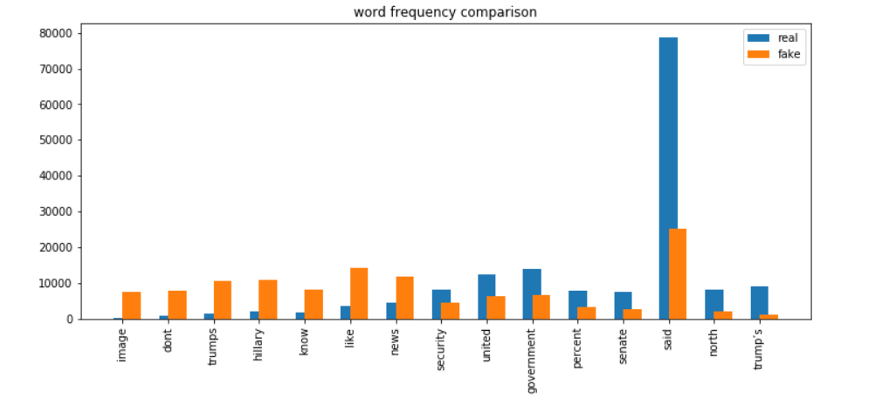

# Classifying News Aricles As Real Or Fake
## By George Bennett
 
In this project I recieved a data set containing thousands of news articles, some fake, some real. I used tf-idf vectorization along with traditional machine learning algorithms to classify the articles. At the end I had a mearure of 99% precision and 99% accuracy in classifying the test set. Along the way I gained insights in how to tell if an article is real or fake.
 
## Tools Used
 
* Pandas 
* Matplotlib 
* Seaborn 
* Scipy 
* Spacy 
* Scikit-learn 
* XGBoost 

#### In Scikit-learn
 
* TfidfVectorizer 
* GridSearchCV 
* LogisticRegression 
* DecisionTreeClassifier 
* RandomForestClassifier 
* classification_report 
 
# How to navigate this repo
Here is a list of files in this repo. They are ordered in the order I created them and they tell a story of the entire process. 
* business_understanding.ipynb 
* Data Cleaning and Preprocessing.ipynb 
* Exploratory Data Analysis.ipynb 
* Random Forest Modeling.ipynb 
* XGBoost.ipynb 
* Random Forest Modeling.ipynb 
* Decision Tree Modeling.ipynb 
* Logistic Regression Modeling.ipynb 
* Final Evaluation.ipynb 
* Executive_Summary.pdf 

 
# The Process
## Stage 1: Cleaning the data
In this stage I inspected the data and noticed differences in the two sets of articles that could be dead give-aways. Some things such as twitter handles and publisher information had to be removed. Also there were some formating differences such as an added space at the beginning of headlines for fake news.
 
## Stage 2: Exploratory Data Analysis
In this stage I looked at the vocabularies of both real and fake news as well as the word frequencies. I used Spacy to break down articles into their parts of speech and looked to see if there were differences in frequencies of parts of speech. I looked at the distributions of the lengths of the articles, as well as the distributions of the articles' vocabulary sizes. The insights I gained from this analysis is that real news uses the word "said" much more often. Fake news uses the word "hillary" much more often and contains more images.

 
## Stage 3: Modeling
In this stage I used a training set and validation set to experiment with models. I used several machine learning algorithms. I used a grid search to find the best possible hyper parameters. I used Scikit-Lean's tf-idf vectorizer to turn the text an array of values. Logistic regression and XGBoost both did very well.
 
## Stage 4: Final Evaluation
Finally I chose the logistic regression model because it is simpler than XGBoost. I used tf-idf to vectorize the text data, fiting it only to the training data but transforming both the train and test data. Then I fit a logistic regression model with the hyperparameters found in the modeling stage. I predicted values for the test set and made a classification report. In the end the model had 99% precision and 99% accuracy on the unseen test data.

# Where To Find The Data Set
You can find the dataset <a href="https://www.kaggle.com/clmentbisaillon/fake-and-real-news-dataset">here</a> at kaggle.com
 
## Acknowledgements
Ahmed H, Traore I, Saad S. “Detecting opinion spams and fake news using text classification”, Journal of Security and Privacy, Volume 1, Issue 1, Wiley, January/February 2018.
Ahmed H, Traore I, Saad S. (2017) “Detection of Online Fake News Using N-Gram Analysis and Machine Learning Techniques. In: Traore I., Woungang I., Awad A. (eds) Intelligent, Secure, and Dependable Systems in Distributed and Cloud Environments. ISDDC 2017. Lecture Notes in Computer Science, vol 10618. Springer, Cham (pp. 127-138).